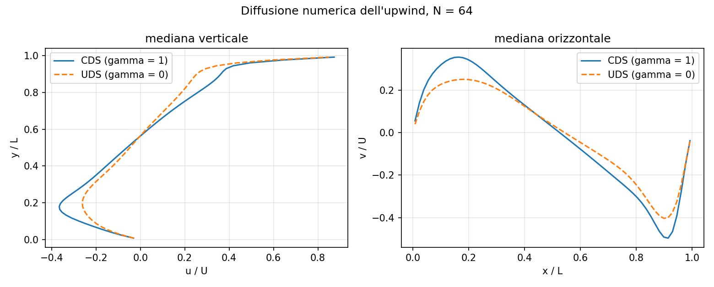
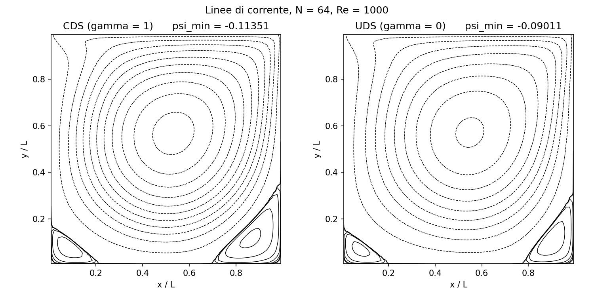
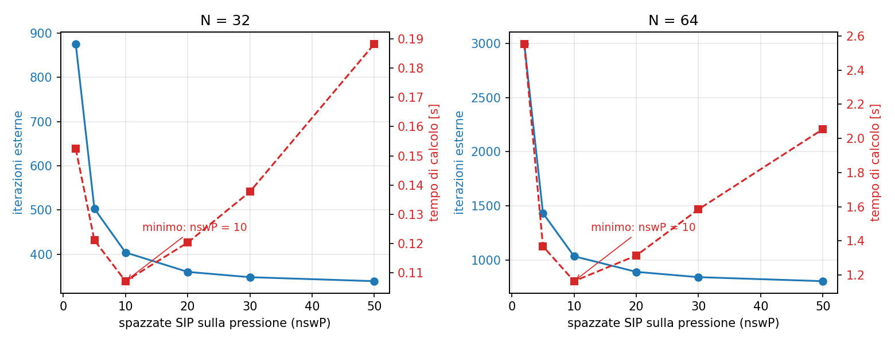

# cavity-simple

A finite-volume solver for the steady incompressible Navier–Stokes equations,
applied to the lid-driven cavity. Uniform Cartesian grid, collocated variables,
SIMPLE coupling.

Written in C++ while working through Ferziger, Perić & Street, *Computational
Methods for Fluid Dynamics*. The aim is not speed. The aim is a solver where
every choice can be explained, and where the claims made below are backed by
something in the repository.

## Problem

A square cavity of side `L`. The lid slides at constant speed `U`; the other
three walls are fixed. No-slip everywhere. Steady laminar flow at
`Re = ρUL/μ`.

## Numerical method

| Component | Choice |
|---|---|
| Discretisation | Finite volume, cell-centred |
| Grid | Uniform Cartesian, **collocated** |
| Convection | Upwind in the matrix, deferred correction towards CDS (blending factor `gamma`) |
| Diffusion | Central differences (2nd order) |
| Pressure–velocity coupling | SIMPLE |
| Checkerboard suppression | Rhie–Chow momentum interpolation |
| Linear solver | Stone's SIP, α = 0.92 |
| Streamfunction | Poisson equation `lap(psi) = -omega`, same SIP |
| Walls | Diffusive coefficient `2μ` (the wall sits `Δx/2` from the cell centre), no mass flux |

Four choices deserve an explanation, because they are where a collocated SIMPLE
solver is usually either right or wrong.

### Why Rhie–Chow is needed

The obvious way to get a velocity on a face is to average the two neighbouring
cell values. That average carries with it the central pressure gradients of both
cells, and inside those gradients the term `p_E − p_P` cancels. The face mass
flux ends up blind to the pressure difference across the very face it crosses.
A pressure field oscillating from one cell to the next then looks perfectly
acceptable to the continuity equation, and nothing removes it.

Rhie–Chow subtracts the averaged gradient and puts back the two-point one. The
face flux now responds to `p_E − p_P` with coefficient `(V/A_P)_e`. On a smooth
field the two gradients nearly agree and little changes; on an oscillating field
they do not, and the oscillation is damped.

The term is deliberately inconsistent at `O(Δx²)`. The same coefficient
`(V/A_P)_f` also appears in the pressure-correction equation, and that is not a
coincidence: it is what makes the correction actually drive the mass imbalance
to zero.

### Why the convection scheme is deferred, not selected

The matrix always holds the upwind coefficients. The difference between the
face value we want and the upwind one goes into the source term, computed from
the previous iterate and multiplied by `gamma`.

At convergence the explicit upwind contribution cancels the implicit one, and
what remains is `gamma·CDS + (1−gamma)·UDS`. So `gamma = 1` gives pure central
differences, `gamma = 0` pure upwind, and anything between gives a blend — all
from one code path, with a matrix that keeps the diagonal dominance of upwind.

§5.8 explains why that matters: of the two schemes only upwind satisfies
`A_P ≥ Σ|A_l|`, which is the sufficient condition for iterative solvers to
converge. The practical consequence is measured below.

### The pressure system is singular

Pressure is only defined up to a constant, so the pressure-correction matrix has
no unique solution. Cell 0 is pinned with `p' = 0`. The compatibility condition
holds because every boundary face is a wall: the mass imbalances of the
individual cells cancel when summed over the domain.

### Under-relaxation

Applied implicitly, `A_P ← A_P/α_u` and `Q ← Q + (1−α_u)·A_P·φ_old`, not by
mixing successive solutions.

## Build and run

```bash
g++ -O2 -o cavity cavity_simple.cpp
./cavity
```

No external dependencies. Parameters are given as `key=value` on the command
line; anything left out keeps its default.

```bash
./cavity N=128 Re=1000 gamma=1 nswUV=3 nswP=10 tol=1e-4
./cavity --spazzate            # inner sweep study
```

| Key | Default | Meaning |
|---|---|---|
| `N` | 128 | cells per direction |
| `Re` | 1000 | Reynolds number |
| `U`, `rho`, `L` | 5, 1000, 1 | lid speed, density, cavity side |
| `au`, `ap` | 0.8, 0.2 | under-relaxation, velocity and pressure |
| `gamma` | 1 | 1 = CDS, 0 = UDS, in between a blend |
| `nswUV`, `nswP` | 3, 20 | SIP sweeps per outer iteration |
| `tol` | 1e-4 | required *relative* residual reduction |
| `maxIter` | 5000 | iteration cap |

Output files: `campo.csv` (one row per cell: `x, y, u, v, p, psi`),
`parametri.csv` (settings, iteration count, residual, wall-clock time, vortex
strengths) and `spazzate.csv` (one row per run of the sweep study).

The figures below are produced by `grafici.py`, which reads those files. It
takes the grid size from the data rather than having it written in, so the
figures stay correct when the grid changes.

## Convergence criterion

For each equation, the residual is the L1 norm of `q − A·φ` taken before the
inner sweeps. It measures how far the current field is from satisfying the
discrete equation. Each residual is divided by its own value at the first outer
iteration, and the largest of the three ratios is compared against `tol`.

Normalising is not cosmetic. A plain sum over cells makes the tolerance depend
on the grid: the same number would mean something different at N = 64 and at
N = 256. Any study comparing iteration counts between configurations would then
be partly measuring its own stopping rule. §5.7 gives the targets: inner
iterations can stop after a reduction of one or two orders of magnitude, outer
iterations should not stop before three to five.

## Status

- [x] SIP linear solver
- [x] Momentum equations, deferred correction UDS/CDS
- [x] Rhie–Chow interpolation
- [x] SIMPLE loop with pressure correction
- [x] Relative convergence criterion
- [x] Runtime parameters and machine-readable output
- [x] Streamfunction from the vorticity Poisson equation, with cross-checks
- [x] Inner sweep study
- [ ] Validation against Ghia et al. (see below)
- [ ] Non-uniform grid
- [ ] Grid-convergence study with Richardson extrapolation and GCI
- [ ] Under-relaxation study

## Results

Reference values from §8.4.1 at Re = 1000: `psi_min = -0.11893`,
`psi_max = 0.00173`.

### The deferred correction buys robustness

An earlier version of this solver put the central-difference coefficients
straight into the matrix. Switching to implicit upwind plus deferred correction
changes what the solver can handle on a coarse grid:

| Grid | CDS in the matrix | Deferred correction, `gamma = 1` |
|---|---|---|
| 32 × 32 | diverges (NaN) | converges |
| 64 × 64 | converges | converges |
| 128 × 128 | converges | converges |

At N = 32 and Re = 1000 the cell Peclet number is above 30. The central scheme
loses diagonal dominance and SIP fails outright. This is the condition of §5.8
showing up as a crash rather than as a theorem.

### The two formulations are not identical, and should not be

With `gamma = 1` the new solver does not reproduce the old CDS-in-matrix result
exactly. It cannot, and the reason is worth spelling out.

The diagonal `A_P` is different in the two cases, and `A_P` feeds both the
Rhie–Chow damping and the pressure-correction equation. At convergence the mass
imbalance vanishes, which leaves `A_P → 4μ + A_wall` for central differences but
`A_P → Σ max(m,0) + 4μ + A_wall` for upwind. Where convection dominates, the
second is much larger.

So the gap between the two should grow with convection and shrink with grid
refinement. It does. Largest difference in `u`, as a fraction of the peak
velocity, at N = 64:

| Re | 10 | 100 | 1000 |
|---|---|---|---|
| difference | 0.05% | 0.50% | 4.81% |

At Re = 1000 the difference drops from 4.81% at N = 64 to 2.48% at N = 128.
These are two different discretisations heading for the same continuum solution,
not two implementations of the same one.

### How much the upwind scheme smears the solution

Same grid (64 × 64), same Reynolds number (1000), both converged to a residual
reduction of nine orders.



The two profiles share the same shape, but the upwind curves are flatter
everywhere. The peaks are cut down and the near-wall gradients are softened.
Nothing here is unstable or noisy — the solution just looks like a lower
Reynolds number than the one requested. That is numerical diffusion: the upwind
scheme adds an artificial viscosity proportional to the cell size, and on this
grid it is not small.



The streamlines make the cost easier to see. The primary vortex is weaker and
its centre has drifted. The two corner vortices, drawn with the same contour
levels in both panels, are visibly smaller on the right.

| | `gamma = 1` (CDS) | `gamma = 0` (UDS) |
|---|---|---|
| `psi_min` | -0.11351 | -0.09011 |
| `psi_max` | 0.00183 | 0.00104 |

Upwind underestimates the primary vortex by about 24% here, and the corner
vortices by considerably more. Those corner vortices are the demanding
quantity, which is why the book reports both.

### How many inner sweeps to spend

`./cavity --spazzate` varies `nswP` at fixed `nswUV`, then `nswUV` at the best
`nswP`, on two grids.

§12.2.2.1 sets out the trade-off. Solving the inner systems accurately is wasted
effort, because the coefficients will be rebuilt many times before the
non-linear problem is anywhere near solved. But stopping too early pushes the
work onto the outer loop, and the total cost goes up again. Where the optimum
sits depends on the problem, so it has to be measured.



The two curves tell different stories, and that is the whole point. Outer
iterations (blue) fall the whole way: more sweeps on the pressure always means
fewer outer iterations. Wall-clock time (red) has a clear minimum around
`nswP = 10`, then climbs again as each iteration gets more expensive than it is
worth. Anyone measuring only the iteration count would conclude that more sweeps
are always better, which is the wrong answer.

At N = 64:

| `nswP` | outer iterations | wall-clock |
|---|---|---|
| 2 | 2996 | 2.55 s |
| 5 | 1432 | 1.37 s |
| 10 | 1034 | **1.16 s** |
| 20 | 890 | 1.31 s |
| 30 | 841 | 1.59 s |
| 50 | 804 | 2.05 s |

The minimum is at `nswP = 10` on both grids tested. Varying `nswUV` instead, the
outer count stops improving after two or three sweeps while the cost keeps
rising, so there is nothing to gain beyond `nswUV = 3`.

The asymmetry between the two systems is the one described in §7.1.7. The
momentum equations carry convection and have Dirichlet conditions on all four
walls, and under-relaxation adds further to their diagonal — they are easy. The
pressure correction is a pure Poisson problem with no Dirichlet condition
anywhere, singular up to a constant and anchored only by the reference cell —
it is not.

## Verification and validation

**Not complete.** The solver converges, the streamfunction post-processing is
cross-checked, and the vortex strengths land within a few percent of the
reference values at N = 64. No comparison against published velocity data has
been committed yet, and nothing above should be read as one.

Planned, in order:

1. Centreline velocity profiles against Ghia, Ghia & Shin (1982) at Re = 100,
   400 and 1000, with the reference tables transcribed from the paper into
   `validation/`.
2. Observed order of accuracy from three systematically refined grids, with GCI.
3. Reproduction of the under-relaxation map of Fig. 8.13.

On the streamfunction: it is obtained by solving the vorticity Poisson equation
down to a residual reduction of eight orders, and the solver warns if it does
not get there. It is then checked against two independent direct integrations,
of `u` along `y` and of `−v` along `x`. All three agree on `psi_min` to four
decimal places.

That check earns its place. A single crude integration from one wall reproduces
`psi_min` to within a few percent but gets `psi_max` wrong by a factor of
several, because the corner vortices are weak enough to disappear under the
accumulated integration error. The post-processing needs verifying just as much
as the solver does.

## Known limitations

Current properties of the code, not open questions.

1. **Rhie–Chow uses the under-relaxed `A_P`.** The damping therefore scales with
   `α_u`, and the converged solution keeps a weak dependence on the relaxation
   factor (Majumdar, 1988). This has to be fixed before the under-relaxation
   study, or the optimum found will not be comparable with the published one.
2. **Pressure at wall faces uses the cell value as the ghost value.** The
   one-sided gradient this produces is effectively taken over `2Δx` instead of
   `Δx`, so it is first-order at the walls. Linear extrapolation would restore
   second order. Expect this to spoil the observed order in a refinement study.
3. **Uniform grid only.** Non-uniform spacing needs face interpolation factors,
   variable cell volumes, and in particular a weighted interpolation of
   `(V/A_P)_f` inside the Rhie–Chow term.
4. **No stagnation or divergence detection** beyond the iteration cap.

## References

- Ferziger, J. H., Perić, M. & Street, R. L., *Computational Methods for Fluid
  Dynamics*, Springer.
- Ghia, U., Ghia, K. N. & Shin, C. T. (1982), "High-Re solutions for
  incompressible flow using the Navier-Stokes equations and a multigrid method",
  *Journal of Computational Physics*, 48(3), 387–411.
- Rhie, C. M. & Chow, W. L. (1983), "Numerical study of the turbulent flow past
  an airfoil with trailing edge separation", *AIAA Journal*, 21(11), 1525–1532.
- Stone, H. L. (1968), "Iterative solution of implicit approximations of
  multidimensional partial differential equations", *SIAM Journal on Numerical
  Analysis*, 5(3), 530–558.
- Majumdar, S. (1988), "Role of underrelaxation in momentum interpolation for
  calculation of flow with nonstaggered grids", *Numerical Heat Transfer*,
  13(1), 125–132.

## Note on tooling

The solver was written by hand from the equations. An AI assistant was used for
code review and refactoring once the numerical method was working. The
discretisation choices, the debugging decisions and the convergence settings are
the author's own, and are documented in the comments.
